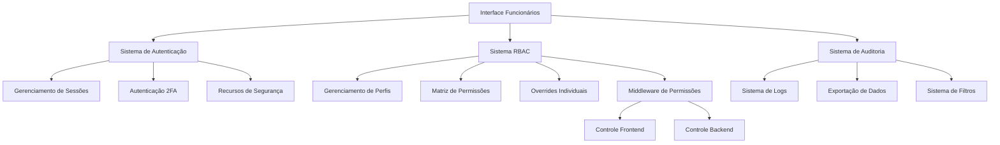

# Design Document - Sistema de Funcionários com RBAC

## Overview

O sistema de funcionários implementará um Role-Based Access Control (RBAC) completo com auditoria detalhada, seguindo o padrão visual do dashboard existente e especificamente o layout da aba TV Box (sem banner). O sistema será composto por três componentes principais: interface de gerenciamento, sistema de permissões e auditoria.

## Architecture

### High-Level Architecture



### Component Structure

```
funcionarios/
├── components/
│   ├── FuncionariosPage.tsx          # Página principal
│   ├── SummaryCards/                 # Cards de resumo
│   │   ├── ActiveEmployeesCard.tsx
│   │   ├── SuspendedEmployeesCard.tsx
│   │   ├── PendingInvitesCard.tsx
│   │   └── LastAccessCard.tsx
│   ├── EmployeeTable/                # Tabela de funcionários
│   │   ├── EmployeeTable.tsx
│   │   ├── EmployeeRow.tsx
│   │   ├── StatusChip.tsx
│   │   ├── PermissionChips.tsx
│   │   └── ActionButtons.tsx
│   ├── AuditPanel/                   # Painel de auditoria
│   │   ├── AuditPanel.tsx
│   │   ├── AuditFilters.tsx
│   │   ├── AuditTable.tsx
│   │   ├── AuditRow.tsx
│   │   └── ExportButton.tsx
│   └── Modals/                       # Modais de gerenciamento
│       ├── NewEmployeeModal.tsx
│       ├── PermissionsModal.tsx
│       ├── EmployeeProfileModal.tsx
│       └── PermissionMatrix.tsx
├── hooks/
│   ├── useEmployees.tsx              # Gerenciamento de funcionários
│   ├── usePermissions.tsx            # Sistema de permissões
│   ├── useAudit.tsx                  # Sistema de auditoria
│   ├── useSecurity.tsx               # Recursos de segurança
│   └── useRBAC.tsx                   # Hook principal RBAC
├── services/
│   ├── employeeService.ts            # API de funcionários
│   ├── permissionService.ts          # API de permissões
│   ├── auditService.ts               # API de auditoria
│   └── securityService.ts            # API de segurança
├── types/
│   ├── employee.types.ts             # Tipos de funcionários
│   ├── permission.types.ts           # Tipos de permissões
│   ├── audit.types.ts                # Tipos de auditoria
│   └── rbac.types.ts                 # Tipos RBAC
└── utils/
    ├── permissionUtils.ts            # Utilitários de permissões
    ├── auditUtils.ts                 # Utilitários de auditoria
    └── securityUtils.ts              # Utilitários de segurança
```

## Components and Interfaces

### 1. Interface Principal (FuncionariosPage)

**Layout Structure:**
- Sem banner (seguindo padrão TV Box)
- Cards de resumo no topo (4 cards em linha)
- Tabela de funcionários no meio
- Painel de auditoria na parte inferior

**Visual Consistency:**
- Mesmas cores de fundo do dashboard
- Sombras e espaçamentos padronizados
- Chips de status com cores consistentes
- Botões seguindo design system existente

### 2. Cards de Resumo (SummaryCards)

```typescript
interface SummaryCardProps {
  title: string;
  value: number | string;
  icon: React.ReactNode;
  color: 'green' | 'red' | 'yellow' | 'blue';
  subtitle?: string;
}

interface SummaryData {
  activeEmployees: number;
  suspendedEmployees: number;
  pendingInvites: number;
  lastAccess: Date | null;
}
```

### 3. Tabela de Funcionários (EmployeeTable)

```typescript
interface Employee {
  id: string;
  name: string;
  email: string;
  role: Role;
  permissions: Permission[];
  lastAccess: Date | null;
  status: 'active' | 'suspended' | 'blocked';
  twoFactorEnabled: boolean;
  createdAt: Date;
  updatedAt: Date;
}

interface EmployeeTableProps {
  employees: Employee[];
  onViewProfile: (employee: Employee) => void;
  onEditPermissions: (employee: Employee) => void;
  onSuspend: (employee: Employee) => void;
  onResetPassword: (employee: Employee) => void;
  onForceLogout: (employee: Employee) => void;
  onRemove: (employee: Employee) => void;
}
```

### 4. Sistema de Permissões (RBAC)

```typescript
interface Role {
  id: string;
  name: string;
  description: string;
  permissions: Permission[];
  isDefault: boolean;
  createdAt: Date;
  updatedAt: Date;
}

interface Permission {
  id: string;
  module: Module;
  action: Action;
  granted: boolean;
  isOverride?: boolean;
}

interface Module {
  id: string;
  name: string;
  displayName: string;
  actions: Action[];
}

interface Action {
  id: string;
  name: string;
  displayName: string;
  requiresView: boolean;
}

// Perfis padrão
const DEFAULT_ROLES: Role[] = [
  {
    name: 'Admin',
    permissions: ['*:*'] // Acesso total
  },
  {
    name: 'Gestor',
    permissions: ['*:*', '!funcionarios:manage_settings'] // Quase tudo exceto config sistema
  },
  {
    name: 'Financeiro',
    permissions: ['cobrancas:*', 'despesas:*', 'dashboard:view']
  },
  {
    name: 'Atendimento',
    permissions: ['clientes:*', 'assinaturas:*', 'tvbox:*']
  },
  {
    name: 'Manutenção/Estoque',
    permissions: ['manutencoes:*', 'equipamentos:*']
  },
  {
    name: 'Leitor',
    permissions: ['*:view'] // Apenas visualização
  }
];

// Módulos do sistema
const SYSTEM_MODULES: Module[] = [
  'clientes', 'assinaturas', 'equipamentos', 'cobrancas', 
  'despesas', 'tvbox', 'locacoes', 'motos', 'manutencoes', 
  'multas', 'contratos', 'funcionarios', 'dashboard'
];

// Ações disponíveis
const SYSTEM_ACTIONS: Action[] = [
  'view', 'create', 'update', 'delete', 
  'export', 'approve', 'manage_settings'
];
```

### 5. Sistema de Auditoria

```typescript
interface AuditLog {
  id: string;
  timestamp: Date;
  actorId: string;
  actorName: string;
  actorRole: string;
  module: string;
  action: string;
  targetType: string;
  targetId: string;
  details: string;
  diffBefore?: any;
  diffAfter?: any;
  ipAddress: string;
  userAgent: string;
}

interface AuditFilters {
  userId?: string;
  module?: string;
  action?: string;
  startDate?: Date;
  endDate?: Date;
}
```

### 6. Modais de Gerenciamento

```typescript
interface NewEmployeeModalProps {
  isOpen: boolean;
  onClose: () => void;
  onSave: (employee: Partial<Employee>) => void;
  roles: Role[];
}

interface PermissionsModalProps {
  isOpen: boolean;
  onClose: () => void;
  employee: Employee;
  onSave: (permissions: Permission[]) => void;
  modules: Module[];
}

interface EmployeeProfileModalProps {
  isOpen: boolean;
  onClose: () => void;
  employee: Employee;
  recentActions: AuditLog[];
}
```

## Data Models

### Database Schema

```sql
-- Tabela de funcionários
CREATE TABLE employees (
  id UUID PRIMARY KEY DEFAULT gen_random_uuid(),
  name VARCHAR(255) NOT NULL,
  email VARCHAR(255) UNIQUE NOT NULL,
  password_hash VARCHAR(255),
  role_id UUID REFERENCES roles(id),
  status VARCHAR(20) DEFAULT 'active',
  two_factor_enabled BOOLEAN DEFAULT false,
  two_factor_secret VARCHAR(255),
  last_access TIMESTAMP,
  created_at TIMESTAMP DEFAULT NOW(),
  updated_at TIMESTAMP DEFAULT NOW()
);

-- Tabela de perfis/roles
CREATE TABLE roles (
  id UUID PRIMARY KEY DEFAULT gen_random_uuid(),
  name VARCHAR(100) UNIQUE NOT NULL,
  description TEXT,
  is_default BOOLEAN DEFAULT false,
  created_at TIMESTAMP DEFAULT NOW(),
  updated_at TIMESTAMP DEFAULT NOW()
);

-- Tabela de permissões por perfil
CREATE TABLE role_permissions (
  id UUID PRIMARY KEY DEFAULT gen_random_uuid(),
  role_id UUID REFERENCES roles(id) ON DELETE CASCADE,
  module VARCHAR(50) NOT NULL,
  action VARCHAR(50) NOT NULL,
  granted BOOLEAN DEFAULT true,
  UNIQUE(role_id, module, action)
);

-- Tabela de overrides de permissões por funcionário
CREATE TABLE employee_permission_overrides (
  id UUID PRIMARY KEY DEFAULT gen_random_uuid(),
  employee_id UUID REFERENCES employees(id) ON DELETE CASCADE,
  module VARCHAR(50) NOT NULL,
  action VARCHAR(50) NOT NULL,
  granted BOOLEAN NOT NULL,
  created_at TIMESTAMP DEFAULT NOW(),
  UNIQUE(employee_id, module, action)
);

-- Tabela de sessões ativas
CREATE TABLE employee_sessions (
  id UUID PRIMARY KEY DEFAULT gen_random_uuid(),
  employee_id UUID REFERENCES employees(id) ON DELETE CASCADE,
  session_token VARCHAR(255) UNIQUE NOT NULL,
  ip_address INET,
  user_agent TEXT,
  created_at TIMESTAMP DEFAULT NOW(),
  expires_at TIMESTAMP NOT NULL
);

-- Tabela de auditoria
CREATE TABLE audit_logs (
  id UUID PRIMARY KEY DEFAULT gen_random_uuid(),
  timestamp TIMESTAMP DEFAULT NOW(),
  actor_id UUID REFERENCES employees(id),
  actor_name VARCHAR(255),
  actor_role VARCHAR(100),
  module VARCHAR(50) NOT NULL,
  action VARCHAR(50) NOT NULL,
  target_type VARCHAR(50),
  target_id VARCHAR(255),
  details TEXT,
  diff_before JSONB,
  diff_after JSONB,
  ip_address INET,
  user_agent TEXT
);

-- Índices para performance
CREATE INDEX idx_employees_email ON employees(email);
CREATE INDEX idx_employees_status ON employees(status);
CREATE INDEX idx_audit_logs_timestamp ON audit_logs(timestamp DESC);
CREATE INDEX idx_audit_logs_actor ON audit_logs(actor_id);
CREATE INDEX idx_audit_logs_module ON audit_logs(module);
CREATE INDEX idx_sessions_employee ON employee_sessions(employee_id);
CREATE INDEX idx_sessions_token ON employee_sessions(session_token);
```

## Error Handling

### Permission Errors

```typescript
class PermissionError extends Error {
  constructor(
    public module: string,
    public action: string,
    public userId: string
  ) {
    super(`Access denied: ${action} on ${module} for user ${userId}`);
    this.name = 'PermissionError';
  }
}

class SessionError extends Error {
  constructor(message: string) {
    super(message);
    this.name = 'SessionError';
  }
}
```

### Error Handling Strategy

1. **Frontend Errors:**
   - Permissões negadas: Ocultar elementos UI
   - Sessão expirada: Redirect para login
   - Erros de rede: Toast com retry

2. **Backend Errors:**
   - 403 Forbidden: Permissão negada
   - 401 Unauthorized: Sessão inválida
   - 429 Too Many Requests: Rate limiting

3. **Audit Errors:**
   - Falha no log: Não bloquear operação
   - Log assíncrono com retry
   - Alertas para administradores

## Testing Strategy

### Unit Tests

```typescript
// Testes de permissões
describe('Permission System', () => {
  test('should deny access without view permission', () => {
    const user = createUser({ role: 'custom', permissions: [] });
    expect(hasPermission(user, 'clientes', 'view')).toBe(false);
  });

  test('should inherit permissions from role', () => {
    const user = createUser({ role: 'financeiro' });
    expect(hasPermission(user, 'cobrancas', 'view')).toBe(true);
    expect(hasPermission(user, 'clientes', 'view')).toBe(false);
  });

  test('should apply individual overrides', () => {
    const user = createUser({ 
      role: 'leitor',
      overrides: [{ module: 'clientes', action: 'create', granted: true }]
    });
    expect(hasPermission(user, 'clientes', 'create')).toBe(true);
  });
});

// Testes de auditoria
describe('Audit System', () => {
  test('should log user actions', async () => {
    await auditService.log({
      actorId: 'user-1',
      module: 'clientes',
      action: 'create',
      targetId: 'client-1'
    });
    
    const logs = await auditService.getLogs({ userId: 'user-1' });
    expect(logs).toHaveLength(1);
  });
});
```

### Integration Tests

```typescript
describe('Employee Management Integration', () => {
  test('should create employee with permissions', async () => {
    const employee = await employeeService.create({
      name: 'Test User',
      email: 'test@example.com',
      role: 'atendimento'
    });
    
    expect(employee.permissions).toContain('clientes:view');
    expect(employee.permissions).not.toContain('despesas:view');
  });

  test('should suspend employee and invalidate sessions', async () => {
    const employee = await employeeService.suspend('user-1');
    const sessions = await sessionService.getActiveSessions('user-1');
    
    expect(employee.status).toBe('suspended');
    expect(sessions).toHaveLength(0);
  });
});
```

### E2E Tests

```typescript
describe('Funcionários Page E2E', () => {
  test('should display employee list for admin', async () => {
    await loginAs('admin');
    await page.goto('/funcionarios');
    
    await expect(page.locator('[data-testid="employee-table"]')).toBeVisible();
    await expect(page.locator('[data-testid="summary-cards"]')).toBeVisible();
    await expect(page.locator('[data-testid="audit-panel"]')).toBeVisible();
  });

  test('should hide sensitive actions for non-admin', async () => {
    await loginAs('gestor');
    await page.goto('/funcionarios');
    
    await expect(page.locator('[data-testid="delete-employee"]')).not.toBeVisible();
    await expect(page.locator('[data-testid="manage-permissions"]')).toBeVisible();
  });
});
```

## Security Considerations

### Authentication & Authorization

1. **Session Management:**
   - JWT tokens com expiração
   - Refresh tokens seguros
   - Invalidação de sessões ativas

2. **2FA Implementation:**
   - TOTP (Time-based One-Time Password)
   - QR codes para configuração
   - Códigos de backup

3. **Rate Limiting:**
   - Login attempts: 5 tentativas por 15 minutos
   - API calls: 100 requests por minuto
   - Export operations: 10 por hora

### Data Protection

1. **Sensitive Data:**
   - Passwords: bcrypt hash
   - 2FA secrets: encrypted storage
   - Audit logs: retention policy

2. **Access Control:**
   - Principle of least privilege
   - Regular permission audits
   - Automatic session cleanup

## Performance Optimizations

### Frontend Optimizations

1. **Component Optimization:**
   - React.memo para componentes pesados
   - useMemo para cálculos complexos
   - Lazy loading de modais

2. **Data Management:**
   - React Query para cache
   - Pagination na tabela
   - Debounce em filtros

### Backend Optimizations

1. **Database:**
   - Índices otimizados
   - Query optimization
   - Connection pooling

2. **Caching:**
   - Redis para sessões
   - Cache de permissões
   - Cache de audit logs

### Monitoring

1. **Performance Metrics:**
   - Response times
   - Database query performance
   - Frontend rendering times

2. **Security Metrics:**
   - Failed login attempts
   - Permission violations
   - Suspicious activities

## Implementation Phases

### Phase 1: Core Infrastructure
- Database schema
- Basic authentication
- Permission system foundation

### Phase 2: UI Components
- Main page layout
- Employee table
- Summary cards

### Phase 3: RBAC System
- Role management
- Permission matrix
- Individual overrides

### Phase 4: Audit System
- Logging infrastructure
- Audit panel
- Export functionality

### Phase 5: Security Features
- 2FA implementation
- Session management
- Rate limiting

### Phase 6: Testing & Polish
- Comprehensive testing
- Performance optimization
- Security audit