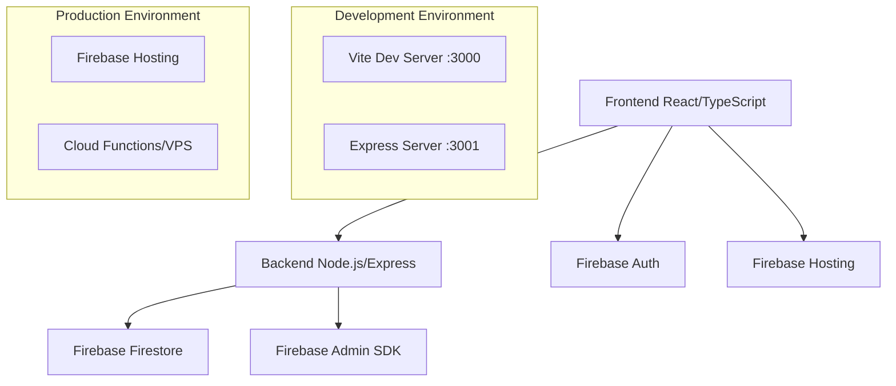

# Design Document

## Overview

O projeto MV SAT SaaS será estruturado como uma aplicação full-stack moderna com frontend React/TypeScript, backend Node.js/Express, e integração completa com Firebase para autenticação, banco de dados e hosting.

## Architecture



## Components and Interfaces

### Frontend Structure
```
mv-sat-saas/frontend/
├── src/
│   ├── components/          # Componentes reutilizáveis
│   ├── pages/              # Páginas da aplicação
│   ├── services/           # Serviços de API e Firebase
│   ├── hooks/              # Custom React hooks
│   ├── types/              # Definições TypeScript
│   ├── utils/              # Utilitários
│   └── App.tsx             # Componente principal
├── public/                 # Assets estáticos
├── package.json
├── vite.config.ts
└── tsconfig.json
```

### Backend Structure
```
mv-sat-saas/backend/
├── src/
│   ├── controllers/        # Controladores das rotas
│   ├── models/            # Modelos de dados
│   ├── routes/            # Definições de rotas
│   ├── middleware/        # Middlewares personalizados
│   ├── services/          # Lógica de negócio
│   ├── utils/             # Utilitários
│   └── server.ts          # Servidor principal
├── package.json
└── tsconfig.json
```

### Root Configuration
```
mv-sat-saas/
├── package.json           # Scripts principais e workspaces
├── firebase.json          # Configuração Firebase
├── .firebaserc           # Projetos Firebase
└── README.md             # Documentação
```

## Data Models

### User Model
```typescript
interface User {
  id: string;
  email: string;
  name: string;
  role: 'admin' | 'user';
  createdAt: Date;
  updatedAt: Date;
}
```

### Client Model (exemplo para SaaS)
```typescript
interface Client {
  id: string;
  name: string;
  email: string;
  phone?: string;
  status: 'active' | 'inactive';
  subscription: {
    plan: string;
    startDate: Date;
    endDate: Date;
  };
  createdAt: Date;
  updatedAt: Date;
}
```

## Error Handling

### Frontend Error Handling
- Toast notifications para erros de usuário
- Error boundaries para erros de componente
- Retry logic para falhas de rede
- Loading states durante operações assíncronas

### Backend Error Handling
- Middleware global de tratamento de erros
- Códigos de status HTTP padronizados
- Logs estruturados para debugging
- Validação de entrada com mensagens claras

### Error Response Format
```typescript
interface ErrorResponse {
  success: false;
  error: {
    code: string;
    message: string;
    details?: any;
  };
}
```

## Testing Strategy

### Frontend Testing
- Jest + React Testing Library para testes unitários
- Cypress para testes E2E
- Storybook para documentação de componentes

### Backend Testing
- Jest para testes unitários
- Supertest para testes de integração
- Firebase Emulator para testes locais

### Test Structure
```
tests/
├── unit/              # Testes unitários
├── integration/       # Testes de integração
└── e2e/              # Testes end-to-end
```

## Development Workflow

### Local Development
1. Frontend roda em `localhost:3000` (Vite)
2. Backend roda em `localhost:3001` (Express)
3. Firebase Emulator para desenvolvimento local
4. Hot reload habilitado em ambos os ambientes

### Build Process
1. TypeScript compilation
2. Bundle optimization (Vite)
3. Asset optimization
4. Environment variable injection

### Deployment Process
1. Build frontend e backend
2. Deploy backend (Cloud Functions ou VPS)
3. Deploy frontend (Firebase Hosting)
4. Update Firestore rules e indexes

## Security Considerations

### Authentication
- Firebase Auth para autenticação segura
- JWT tokens para autorização
- Role-based access control (RBAC)

### API Security
- CORS configurado adequadamente
- Rate limiting
- Input validation e sanitization
- HTTPS obrigatório em produção

### Data Security
- Firestore security rules
- Dados sensíveis criptografados
- Logs sem informações pessoais