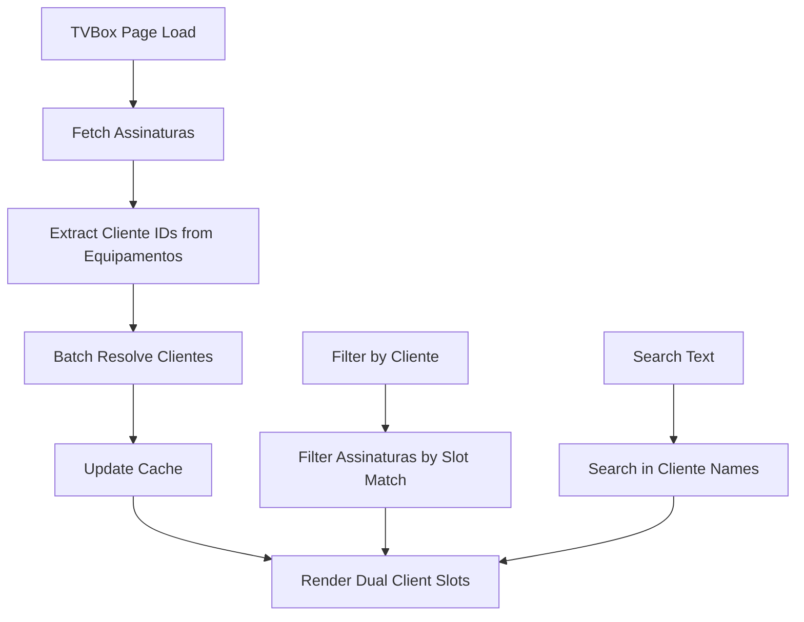
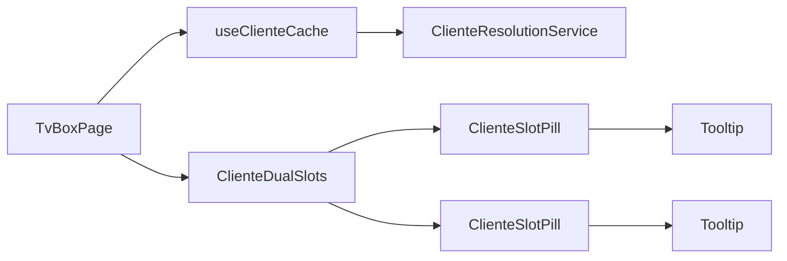

# Documento de Design

## Visão Geral

Esta funcionalidade refatora a coluna "Cliente" na página TVBox para exibir dois slots de cliente por assinatura, representando os clientes vinculados aos equipamentos de cada assinatura. A implementação utiliza a estrutura existente do Firestore e mantém compatibilidade com todos os filtros e funcionalidades atuais.

## Arquitetura

### Estrutura de Dados Atual

**Coleção: `tvbox_assinaturas`**
```typescript
interface TVBoxAssinatura {
  id: string;
  assinatura: string;
  login: string;
  senha: string;
  status: string;
  tipo: string;
  dia_vencimento: number;
  equipamentos: Equipamento[]; // Array com até 2 equipamentos
}
```

**Subcoleção: `equipamentos` (dentro de cada assinatura)**
```typescript
interface Equipamento {
  idAparelho: string;
  nds: string;
  mac: string;
  cliente_nome: string;
  cliente_id: string | null;
}
```

**Coleção: `clientes`**
```typescript
interface Cliente {
  id: string;
  nomeCompleto: string;
  status: string;
  telefone?: string;
}
```

### Fluxo de Dados

1. **Carregamento de Assinaturas**: Busca documentos da coleção `tvbox_assinaturas`
2. **Resolução de Equipamentos**: Para cada assinatura, acessa o array `equipamentos` (limitado a 2 itens)
3. **Resolução de Clientes**: Para cada `cliente_id` encontrado nos equipamentos, busca dados na coleção `clientes`
4. **Cache de Clientes**: Implementa cache local para evitar consultas duplicadas do mesmo cliente
5. **Renderização**: Exibe duas pílulas por linha representando os slots de cliente

## Componentes e Interfaces

### 1. Componente ClienteDualSlots

```typescript
interface ClienteSlot {
  cliente_nome: string;
  cliente_id: string | null;
  equipamento_numero: number;
  isDisponivel: boolean;
}

interface ClienteDualSlotsProps {
  equipamentos: Equipamento[];
  clientesCache: Map<string, Cliente>;
  onClienteClick?: (clienteId: string) => void;
}
```

**Responsabilidades:**
- Renderizar duas pílulas de cliente por assinatura
- Gerenciar estados de loading com skeletons
- Aplicar estilos visuais diferenciados (cliente vs disponível)
- Exibir tooltips informativos

### 2. Hook useClienteCache

```typescript
interface ClienteCacheHook {
  clientesCache: Map<string, Cliente>;
  isLoading: boolean;
  resolveClientes: (clienteIds: string[]) => Promise<void>;
  clearCache: () => void;
}
```

**Responsabilidades:**
- Gerenciar cache local de dados de clientes
- Implementar batch loading para múltiplos clientes
- Evitar consultas duplicadas
- Fornecer fallback para clientes não encontrados

### 3. Serviço ClienteResolutionService

```typescript
class ClienteResolutionService {
  private cache = new Map<string, Cliente>();
  
  async batchResolveClientes(clienteIds: string[]): Promise<Map<string, Cliente>>;
  async resolveClienteById(clienteId: string): Promise<Cliente | null>;
  clearCache(): void;
}
```

**Responsabilidades:**
- Implementar operações em lote para busca de clientes
- Gerenciar cache com TTL (Time To Live)
- Tratar erros de consulta graciosamente
- Otimizar performance das consultas

## Modelos de Dados

### ClienteSlotData

```typescript
interface ClienteSlotData {
  slot1: {
    cliente_nome: string;
    cliente_id: string | null;
    isDisponivel: boolean;
    equipamento_numero: 1;
  };
  slot2: {
    cliente_nome: string;
    cliente_id: string | null;
    isDisponivel: boolean;
    equipamento_numero: 2;
  };
}
```

### TVBoxRowData (Extensão da interface existente)

```typescript
interface TVBoxRowData extends TVBox {
  clienteSlots: ClienteSlotData;
  clientesResolvidos: Map<string, Cliente>;
}
```

## Tratamento de Erros

### Estratégias de Fallback

1. **Cliente não encontrado**: Exibe "Disponível" no slot
2. **Erro de rede**: Mantém dados em cache e exibe indicador de erro
3. **Timeout de consulta**: Fallback para "Carregando..." por tempo limitado
4. **Dados inconsistentes**: Sanitização automática com logs de debug

### Estados de Loading

```typescript
enum ClienteSlotState {
  LOADING = 'loading',
  LOADED = 'loaded',
  ERROR = 'error',
  DISPONIVEL = 'disponivel'
}
```

## Estratégia de Testes

### Testes Unitários

1. **ClienteDualSlots Component**
   - Renderização com 2 clientes válidos
   - Renderização com 1 cliente + 1 disponível
   - Renderização com 2 disponíveis
   - Estados de loading e erro

2. **useClienteCache Hook**
   - Cache hit/miss scenarios
   - Batch loading functionality
   - Error handling

3. **ClienteResolutionService**
   - Batch operations
   - Cache management
   - Error scenarios

### Testes de Integração

1. **Fluxo completo de carregamento**
   - Carregamento de assinaturas → equipamentos → clientes
   - Performance com múltiplas assinaturas
   - Comportamento com dados inconsistentes

2. **Filtros e busca**
   - Filtro por cliente específico
   - Busca por nome de cliente
   - Combinação de filtros

### Cenários de Teste

```typescript
// Cenário 1: Assinatura com 2 equipamentos e 2 clientes
const mockAssinatura1 = {
  equipamentos: [
    { cliente_id: 'cliente1', cliente_nome: 'João Silva' },
    { cliente_id: 'cliente2', cliente_nome: 'Maria Santos' }
  ]
};

// Cenário 2: Assinatura com 1 equipamento e 1 cliente
const mockAssinatura2 = {
  equipamentos: [
    { cliente_id: 'cliente1', cliente_nome: 'João Silva' },
    { cliente_id: null, cliente_nome: 'Disponível' }
  ]
};

// Cenário 3: Assinatura sem clientes
const mockAssinatura3 = {
  equipamentos: [
    { cliente_id: null, cliente_nome: 'Disponível' },
    { cliente_id: null, cliente_nome: 'Disponível' }
  ]
};
```

## Considerações de Performance

### Otimizações Implementadas

1. **Cache de Clientes**: Evita consultas duplicadas para o mesmo cliente
2. **Batch Loading**: Agrupa consultas de múltiplos clientes em uma operação
3. **Lazy Loading**: Carrega dados de cliente apenas quando necessário
4. **Debounce**: Aplica debounce em filtros e busca para reduzir consultas

### Métricas de Performance

- **Tempo de carregamento inicial**: < 2 segundos para 50 assinaturas
- **Cache hit rate**: > 80% após carregamento inicial
- **Consultas Firestore**: Máximo 1 consulta por cliente único + 1 consulta para assinaturas
- **Memória**: Cache limitado a 1000 entradas com TTL de 5 minutos

## Compatibilidade e Migração

### Compatibilidade com Código Existente

- Mantém todas as interfaces existentes da página TVBox
- Preserva funcionalidade de filtros e busca
- Não altera estrutura de dados no Firestore
- Reutiliza serviços e hooks existentes quando possível

### Estratégia de Rollback

- Implementação através de feature flag
- Possibilidade de reverter para coluna cliente única
- Logs detalhados para monitoramento
- Testes A/B para validação gradual

## Diagramas

### Fluxo de Dados



### Arquitetura de Componentes

