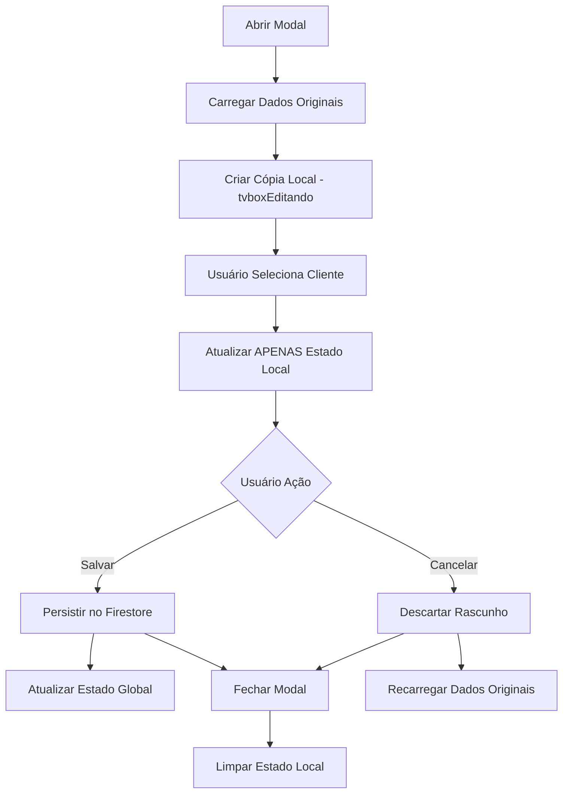

# Documento de Design

## Visão Geral

Este design implementa a funcionalidade de seleção de cliente no modal "Editar Assinatura" da TV BOX, garantindo que mudanças sejam mantidas apenas no estado local (rascunho) até que o usuário clique em "Salvar". A implementação modifica o comportamento atual onde as mudanças são aplicadas imediatamente tanto no estado local quanto no estado global da aplicação.

## Arquitetura

### Estrutura Atual vs. Nova Estrutura

**Atual:**
- Seleção de cliente → Atualiza estado local (`tvboxEditando`) + estado global (`tvboxes`)
- Salvar → Persiste no Firestore
- Cancelar → Descarta apenas estado local

**Nova:**
- Seleção de cliente → Atualiza APENAS estado local (`tvboxEditando`)
- Salvar → Persiste no Firestore + atualiza estado global
- Cancelar → Descarta estado local + recarrega dados originais

### Componentes Afetados

1. **TvBoxPage.tsx** - Página principal que contém o modal
2. **Funções de gerenciamento de estado:**
   - `atualizarEquipamento()` - Modificada para não atualizar estado global
   - `salvarAlteracoes()` - Mantida com pequenos ajustes
   - `cancelarEdicao()` - Modificada para garantir limpeza completa
   - `abrirModalEditar()` - Modificada para criar cópia profunda dos dados

## Componentes e Interfaces

### Estado Local do Modal

```typescript
interface TVBoxEditando {
  id: string;
  assinatura: string;
  status: string;
  login: string;
  senha: string;
  renovacaoDia?: number;
  renovacaoData?: string;
  equipamentos: Equipamento[];
  // ... outros campos
}

interface Equipamento {
  idAparelho: string;
  nds?: string;
  mac?: string;
  cliente_id?: string | null;
  cliente_nome?: string;
  cliente?: string; // Texto visível no campo
  slotIndex?: number;
}
```

### Fluxo de Dados



## Modelos de Dados

### Estado do Rascunho

O estado `tvboxEditando` mantém uma cópia independente dos dados originais:

```typescript
// Estado original (preservado)
const tvboxOriginal = tvboxes.find(t => t.id === selectedId);

// Estado do rascunho (modificável)
const [tvboxEditando, setTvboxEditando] = useState<TVBox | null>(null);
```

### Campos de Cliente por Equipamento

Cada equipamento mantém três campos relacionados ao cliente:

```typescript
{
  cliente_id: string | null,     // ID do cliente no Firestore
  cliente_nome: string,          // Nome do cliente para busca/filtro
  cliente: string               // Texto exibido no campo (nome ou "Disponível")
}
```

## Tratamento de Erros

### Cenários de Erro

1. **Falha ao Salvar**
   - Manter modal aberto com dados do rascunho
   - Exibir mensagem de erro clara
   - Permitir nova tentativa de salvamento

2. **Cliente Inexistente**
   - Verificar se cliente_id existe na lista de clientes
   - Fallback para "Disponível" se cliente não encontrado
   - Log de warning para debugging

3. **Dados Corrompidos**
   - Validar estrutura de equipamentos ao abrir modal
   - Criar estrutura padrão se necessário
   - Garantir que sempre existam os campos obrigatórios

### Implementação de Tratamento de Erros

```typescript
const validarDadosEquipamento = (equipamento: Equipamento): Equipamento => {
  return {
    ...equipamento,
    cliente_id: equipamento.cliente_id || null,
    cliente_nome: equipamento.cliente_nome || 'Disponível',
    cliente: equipamento.cliente || 'Disponível'
  };
};
```

## Estratégia de Testes

### Testes Unitários

1. **Função atualizarEquipamento**
   - Verificar que apenas estado local é atualizado
   - Confirmar que estado global permanece inalterado
   - Testar atualização de múltiplos campos

2. **Função salvarAlteracoes**
   - Verificar persistência no Firestore
   - Confirmar atualização do estado global após salvamento
   - Testar tratamento de erros de rede

3. **Função cancelarEdicao**
   - Verificar limpeza completa do estado local
   - Confirmar que dados originais são preservados
   - Testar fechamento correto do modal

### Testes de Integração

1. **Fluxo Completo de Edição**
   - Abrir modal → Selecionar cliente → Salvar → Verificar persistência
   - Abrir modal → Selecionar cliente → Cancelar → Verificar descarte

2. **Múltiplas Seleções**
   - Selecionar cliente A → Selecionar cliente B → Verificar substituição
   - Selecionar cliente → Remover seleção → Verificar "Disponível"

3. **Cenários de Erro**
   - Falha de rede durante salvamento
   - Cliente removido durante edição
   - Dados corrompidos no Firestore

### Testes de Interface

1. **Feedback Visual**
   - Verificar atualização imediata do campo cliente
   - Confirmar que outros campos não são afetados
   - Testar indicadores de carregamento

2. **Experiência do Usuário**
   - Verificar responsividade da seleção
   - Confirmar clareza das mensagens de erro
   - Testar acessibilidade do seletor

## Considerações de Performance

### Otimizações

1. **Cópia Profunda Eficiente**
   - Usar `structuredClone()` ou implementação otimizada
   - Evitar cópias desnecessárias de dados grandes
   - Manter referências para dados não modificáveis

2. **Atualizações de Estado**
   - Usar callback functions para evitar re-renders
   - Implementar debounce se necessário para múltiplas mudanças
   - Otimizar re-renderização do seletor de clientes

3. **Gerenciamento de Memória**
   - Limpar estado local ao fechar modal
   - Evitar vazamentos de memória em event listeners
   - Usar useCallback para funções estáveis

### Monitoramento

```typescript
// Logging para debugging e monitoramento
const logStateChange = (action: string, before: any, after: any) => {
  if (process.env.NODE_ENV === 'development') {
    console.log(`🔄 ${action}:`, { before, after });
  }
};
```

## Implementação Técnica

### Modificações Principais

1. **atualizarEquipamento() - Remover Atualização Global**
```typescript
// ANTES: Atualiza local + global
setTvboxes(prev => prev.map(tvbox => 
  tvbox.id === tvboxEditando.id 
    ? { ...tvbox, equipamentos: equipamentosAtualizados }
    : tvbox
));

// DEPOIS: Apenas local
// Remover completamente a atualização do estado global
```

2. **salvarAlteracoes() - Adicionar Atualização Global**
```typescript
// Após sucesso no Firestore, atualizar estado global
setTvboxes(prev => prev.map(tvbox => 
  tvbox.id === tvboxEditando.id 
    ? { ...tvbox, ...dadosSalvos }
    : tvbox
));
```

3. **abrirModalEditar() - Cópia Profunda**
```typescript
const abrirModalEditar = (tvbox: TVBox) => {
  // Criar cópia profunda para evitar mutação acidental
  setTvboxEditando(structuredClone(tvbox));
  setShowModalEditar(true);
  setShowModalVisualizar(false);
};
```

4. **cancelarEdicao() - Limpeza Completa**
```typescript
const cancelarEdicao = () => {
  setShowModalEditar(false);
  setTvboxEditando(null); // Limpar completamente o estado
  // Não é necessário recarregar dados pois estado global não foi alterado
};
```

### Validações Adicionais

```typescript
const validarSelecaoCliente = (clienteId: string, clientes: Cliente[]): boolean => {
  if (!clienteId) return true; // "Disponível" é válido
  return clientes.some(c => c.id === clienteId);
};

const sanitizarDadosCliente = (equipamento: Equipamento, clientes: Cliente[]) => {
  if (!equipamento.cliente_id) {
    return {
      ...equipamento,
      cliente_id: null,
      cliente_nome: 'Disponível',
      cliente: 'Disponível (Sem cliente)'
    };
  }
  
  const cliente = clientes.find(c => c.id === equipamento.cliente_id);
  if (!cliente) {
    console.warn(`Cliente ${equipamento.cliente_id} não encontrado`);
    return {
      ...equipamento,
      cliente_id: null,
      cliente_nome: 'Disponível',
      cliente: 'Disponível (Sem cliente)'
    };
  }
  
  return {
    ...equipamento,
    cliente_nome: cliente.nome,
    cliente: cliente.nome
  };
};
```